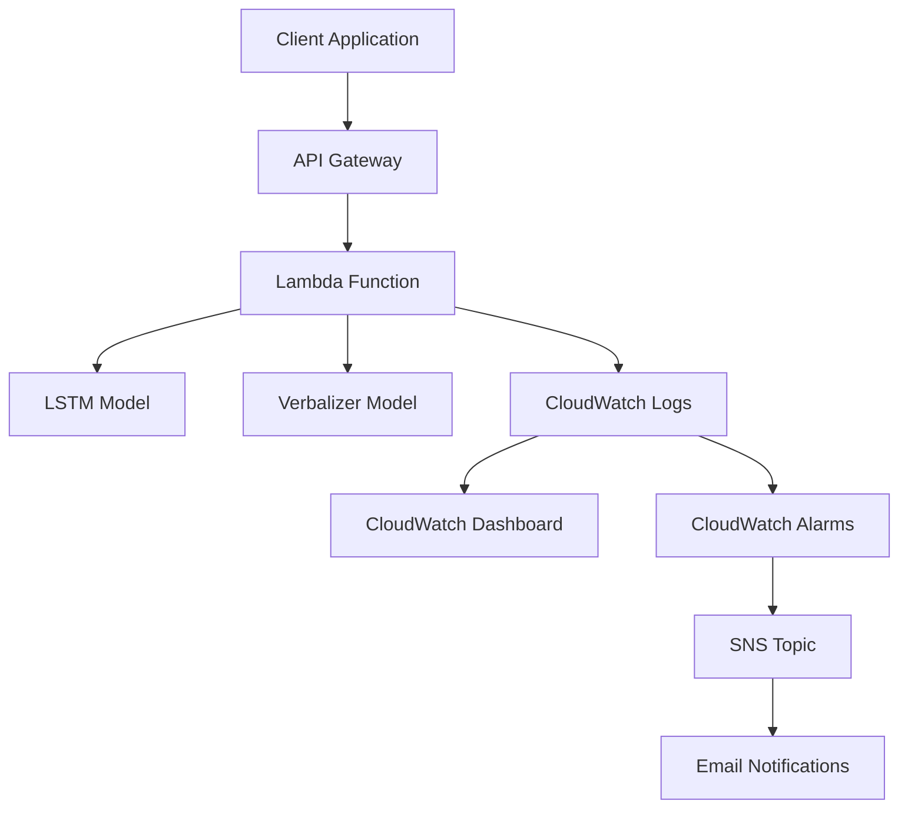

# 🚀 Complete Deployment Guide

This guide walks you through deploying the sentiment analysis API to AWS using the modular CDK architecture.

## 📋 Overview

The deployment creates:

- **AWS Lambda Function** (Docker container with LSTM + Verbalizer models)
- **API Gateway** (REST API with API key authentication)
- **CloudWatch Monitoring** (Logs, metrics, alarms, dashboard)
- **SNS Notifications** (Optional email alerts)

## 🏗️ Architecture



## 🔧 Prerequisites

### Required Software

- ✅ **Python 3.9+** with virtual environment
- ✅ **AWS CLI** configured with appropriate permissions
- ✅ **Docker** installed and running
- ✅ **Node.js 16+** and **AWS CDK**: `npm install -g aws-cdk`

### AWS Permissions Required

Your AWS credentials need permissions for:

- Lambda (create/update functions)
- API Gateway (create/manage APIs)
- IAM (create roles)
- CloudFormation (deploy stacks)
- ECR (push Docker images)
- CloudWatch (logs, metrics, alarms)
- SNS (notifications)

### Verify Prerequisites

```bash
# Check AWS CLI
aws sts get-caller-identity

# Check Docker
docker --version
docker info

# Check CDK
cdk --version

# Check Python
python --version
```

## 📦 Step 1: Prepare Models

### Train Models (if not already done)

```bash
cd buildops

# Quick training for testing
python compare_all_models.py --quick

# OR full training for production
python compare_all_models.py --full
```

### Export Models for Deployment

```bash
python deployment/scripts/export_models.py
```

**Expected output:**

```
📦 MODEL EXPORT PIPELINE FOR LAMBDA DEPLOYMENT
✅ LSTM model exported
✅ Verbalizer model exported
✅ Deployment manifest created
🎉 MODEL EXPORT COMPLETED SUCCESSFULLY!
```

### Copy Models to Lambda Directory

**Windows:**

```cmd
copy_models.bat
```

**macOS/Linux:**

```bash
./copy_models.sh
```

## 🔍 Step 2: Validate Deployment Setup

Run the validation script to check everything is ready:

```bash
python deployment/scripts/validate_deployment.py
```

This will check:

- ✅ Model artifacts are exported
- ✅ Models are copied to Lambda directory
- ✅ Lambda code is present
- ✅ CDK setup is complete
- ✅ AWS CLI is configured
- ✅ Docker is running
- ✅ CDK CLI is installed
- ✅ Local Lambda test passes

## 🚀 Step 3: Deploy with CDK

### Install CDK Dependencies

```bash
cd deployment/cdk
pip install -r requirements.txt
```

### Bootstrap CDK (First Time Only)

```bash
cdk bootstrap
```

### Deploy the Stack

```bash
cdk deploy
```

**Optional: Deploy with email notifications**

```bash
cdk deploy --parameters alarm-email=your-email@example.com
```

**CDK will:**

- 🐳 Build Docker image with your models
- 📤 Push image to AWS ECR
- 🚀 Create Lambda function
- 🌐 Set up API Gateway
- 🔑 Configure API key authentication
- 📊 Set up CloudWatch monitoring

## 📊 Step 4: Test Your Deployment

### Get API Key

```bash
# Get the API key ID from CDK output, then:
aws apigateway get-api-key --api-key YOUR_API_KEY_ID --include-value --query 'value' --output text
```

### Test Health Endpoint

```bash
curl https://your-api-url/health
```

**Expected response:**

```json
{
  "status": "healthy",
  "models_available": 2,
  "available_models": ["lstm", "verbalizer"],
  "version": "2.0.0"
}
```

### Test Prediction Endpoint

```bash
curl -X POST https://your-api-url/predict \
  -H "Content-Type: application/json" \
  -H "x-api-key: YOUR_API_KEY" \
  -d '{
    "text": "This movie was absolutely fantastic!",
    "model": "both"
  }'
```

**Expected response:**

```json
{
  "text": "This movie was absolutely fantastic!",
  "predictions": {
    "lstm": {
      "prediction": "positive",
      "confidence": 0.78,
      "processing_time_ms": 45
    },
    "verbalizer": {
      "prediction": "positive",
      "confidence": 0.87,
      "processing_time_ms": 25
    }
  },
  "consensus": {
    "prediction": "positive",
    "agreement": true,
    "avg_confidence": 0.825,
    "models_count": 2
  },
  "total_processing_time_ms": 70,
  "models_available": 2
}
```

## 🏗️ Modular Architecture Details

### CDK Structure

```
deployment/cdk/
├── app.py                          # Main CDK app entry point
├── sentiment_stack.py              # Main orchestrating stack
├── constructs/                     # Reusable CDK constructs
│   ├── lambda_construct.py         # Lambda function + IAM roles
│   ├── api_gateway_construct.py    # API Gateway + API keys
│   └── monitoring_construct.py     # CloudWatch monitoring
├── config/                         # Configuration classes
│   ├── lambda_config.py            # Lambda configuration
│   ├── api_config.py               # API Gateway configuration
│   └── monitoring_config.py        # Monitoring configuration
└── utils/                          # Utility functions
    └── common.py                   # Common utilities
```

### Benefits of Modular Architecture

- **Separation of Concerns**: Each construct handles one AWS service
- **Reusability**: Constructs can be reused across different stacks
- **Maintainability**: Easy to modify individual components
- **Testability**: Each construct can be tested independently
- **Scalability**: Easy to add new features and services

### Configuration Management

Each component has its own configuration class:

```python
# Lambda configuration
lambda_config = LambdaConfig(
    memory_size=2048,
    timeout=Duration.minutes(5),
    environment_vars={"MODEL_PATH": "/var/task/models"}
)

# API Gateway configuration
api_config = ApiConfig(
    throttle_rate_limit=100,
    quota_limit=10000,
    cors_allow_origins=["*"]
)

# Monitoring configuration
monitoring_config = MonitoringConfig(
    enable_alarms=True,
    enable_dashboard=True,
    alarm_email="alerts@example.com"
)
```

## 📊 Monitoring & Observability

### CloudWatch Dashboard

Access your dashboard at: `https://console.aws.amazon.com/cloudwatch/home?region=us-east-1#dashboards`

**Widgets include:**

- Lambda function metrics (invocations, errors, duration)
- API Gateway metrics (requests, latency, errors)
- Custom application metrics
- Recent error logs

### CloudWatch Alarms

Automatic alarms for:

- High error rate (>5% errors)
- High duration (>30 seconds)
- Function throttling
- API Gateway 4XX/5XX errors
- High API latency (>10 seconds)

### Log Analysis

```bash
# View Lambda logs
aws logs tail /aws/lambda/sentiment-analysis --follow

# Query error logs
aws logs start-query \
  --log-group-name "/aws/lambda/sentiment-analysis" \
  --start-time $(date -d '1 hour ago' +%s) \
  --end-time $(date +%s) \
  --query-string 'fields @timestamp, @message | filter @message like /ERROR/ | sort @timestamp desc'
```

## 🔧 Configuration Options

### Environment-Specific Deployments

```bash
# Development environment
cdk deploy --context environment=dev

# Staging environment
cdk deploy --context environment=staging

# Production environment (default)
cdk deploy --context environment=prod
```

### Custom Configuration

Modify configuration in `deployment/cdk/config/` files:

```python
# Increase memory for better performance
lambda_config.memory_size = 4096

# Adjust API throttling
api_config.throttle_rate_limit = 200

# Enable email notifications
monitoring_config.alarm_email = "alerts@yourcompany.com"
```

## 🛠️ Troubleshooting

### Common Issues

**1. Model files not found**

```
❌ Failed to initialize LSTM: [Errno 2] No such file or directory
```

**Solution:** Run `python deployment/scripts/export_models.py` and copy models.

**2. Docker build fails**

```
❌ Error building Docker image
```

**Solution:** Ensure Docker is running and you have sufficient disk space.

**3. CDK deployment fails**

```
❌ Stack deployment failed
```

**Solution:** Check AWS permissions and run `python deployment/scripts/validate_deployment.py`.

**4. API Gateway 403 Forbidden**

```
❌ {"message":"Forbidden"}
```

**Solution:** Include `x-api-key` header in your requests.

### Debug Commands

```bash
# Validate deployment setup
python deployment/scripts/validate_deployment.py

# Check CDK diff
cd deployment/cdk && cdk diff

# View CloudFormation events
aws cloudformation describe-stack-events --stack-name SentimentAnalysisStack

# Test Lambda function directly
aws lambda invoke --function-name sentiment-analysis response.json
```

## 🧹 Cleanup

### Remove Deployment

```bash
cd deployment/cdk
cdk destroy
```

### Clean Local Artifacts

```bash
# Remove exported models
rm -rf artifacts/

# Remove copied models
rm -rf deployment/lambda/models/

# Remove copy scripts
rm copy_models.bat copy_models.sh
```

## 💰 Cost Estimation

### AWS Lambda

- **Requests**: $0.20 per 1M requests
- **Duration**: $0.0000166667 per GB-second
- **Example**: 1000 requests/day ≈ $2-5/month

### API Gateway

- **Requests**: $3.50 per 1M requests
- **Example**: 1000 requests/day ≈ $0.10/month

### CloudWatch

- **Logs**: $0.50 per GB ingested
- **Metrics**: $0.30 per metric per month
- **Alarms**: $0.10 per alarm per month

### Total Estimated Cost

- **Light usage** (100 requests/day): ~$1-2/month
- **Medium usage** (1000 requests/day): ~$5-10/month
- **Heavy usage** (10,000 requests/day): ~$50-100/month

## 🔒 Security Best Practices

1. **API Key Rotation**: Rotate API keys regularly
2. **CORS Configuration**: Restrict origins in production
3. **Rate Limiting**: Implement throttling for production use
4. **VPC Deployment**: Deploy Lambda in VPC for enhanced security
5. **Encryption**: Enable encryption at rest and in transit
6. **IAM Permissions**: Use least privilege principle
7. **Monitoring**: Set up comprehensive logging and alerting

## 📚 Additional Resources

- [AWS Lambda Documentation](https://docs.aws.amazon.com/lambda/)
- [AWS CDK Documentation](https://docs.aws.amazon.com/cdk/)
- [API Gateway Documentation](https://docs.aws.amazon.com/apigateway/)
- [CloudWatch Documentation](https://docs.aws.amazon.com/cloudwatch/)

## 🎉 Success!

Your sentiment analysis API is now live on AWS with:

- ⚡ **Serverless architecture** - No infrastructure management
- 🔄 **Auto-scaling** - Handles traffic spikes automatically
- 💰 **Cost-effective** - Pay only for what you use
- 🌍 **Global availability** - Available worldwide
- 📊 **Full observability** - Comprehensive monitoring
- 🔒 **Secure** - API key authentication and rate limiting
- 🏗️ **Modular** - Easy to extend and maintain

**Next Steps:**

- Integrate with your applications
- Monitor performance and costs
- Scale based on usage patterns
- Add more models or features
- Set up CI/CD pipeline for automated deployments

Happy analyzing! 🚀
